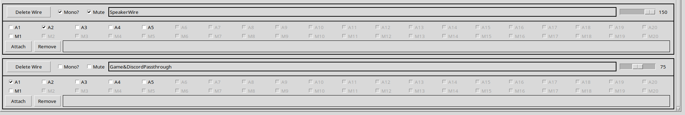

# NullWire
---

Legit. I wanted Virtual Audio Cable back. VoiceMeter is cool, but exccessive, and also too restricted?

So here's my Linux Mint solution!

## What Can It Do?

Simple:

Spotify
→ Headphones

Moderately Stupid:

Games
→ OBS
→ Headphones

Extremely Stupid:

Firefox
→ BrowserWire
→ Headphones (75%)

Firefox
→ BrowserWire
→ SpeakerWire (150%)
→ Speakers

NullWire supports all of these.

You can use One wire, Keep it simple...
Or become me(Not recommended)

---

## How To Use
---

### Part 1. Setting Up Your Devices

(Fair warning. I pla~~y~~n(← my typos will be the end of me. I'm keeping this here.) to redesign this so... This is just for the time being. NullWire was my first UI and it shows, It won't change much. Just will be....better)

First. You go into the "Devices" page. 

For output? You use "A" Devices. or "Audio" Devices. 
Click on "SET"
A popup will appear listing all of your systems Output Devices.
Click one of them bitches. 
...
Yup that's it. Now A# is set to that Audio device. 

SAME for the Microphone side. or "M" Devices
Click Set. It will produce a popup of your Input Devices... Click... and yup, A# is now that Input Device. 

You'll see a setting called "Override System"

It doesn't really "override" the system, but if it is checked. Nullwire will check every second on that device. 
If that devices volume is NOT what you have set in Nullwire? NullWire will set that device to that volume.

Why is this a thing? I got sick of applications taking control of my microphone and adjusting its volume. Added it for Audio Devices too. 

Here is my Devices page for a reference.

There is some...Confusing things on here I'm sure. We will get there.

### Part 2. Setting Up Wires

A Wire is... Well in PipeWIre they're called "sinks", but that's confusing. so Wire it is. 

You Type in the InputField. (That white box besides the big ass Add Button)

Type a Name. say like "Spotify" for instance. and hit Add. 

Congrats you made a Spotify Virtual Audio Cable.... Which does fuck all at the moment. 

NEXT. You need to attach a sound source to it. 

So open spotify. and click play. 

Now that there is a viable sound source Pipewire can detect....

On your Spotify Wire. Click that little "Attach" button. 
A pop up appears... yeah...click on Spotify in the popup. 

Congratulations. 

All Spotify sounds now go into your Spotify wire. 

But now you can't hear Spotify. Wonderful. 

But wait you didn't connect any audio devices. 

See that A1 (Or whatever A you set your device too...the rest will be disabled/grayed out) next to the square white box? 
Click that sumbitch. 

Now. 

SpotifySounds --> SpotifyWire --> YourOutputDevice. 

Seems useless, but this can have... All kinds of uses. 

Here... Here is my Routing Page for a reference.

#### What in the hell?

Looks normal until you see SpeakerWire. Mixed with my Devices also have SpeakerWire as A3.... Let me explain. 

I have some cheap ass 3$ speakers, ok? USB things. only 5w. 
They aren't... Loud.

BUT(T) using my i35(bluetooth headphones) my browser audio is too loud. So I set it to 75
So...

Cheap ass speakers with no power. at 75% volume? No good. Can't hear a damn thing. 
Didn't want to have to keep setting the BrowserWire to 150 and 75 constantly. Solution?

Create a SpeakerWire....Wire. 
Added this as an Audio device...Because it is. 

Already confusing. But a wire can also be an audio output device...it DOES output audio after all. So its A3. 

So.                           
——————————————A1(headphones)
——————————————/
FireFoxSound → BrowserWire (75% volume)
——————————————\
——————————————peakerWire(150% volume) → A2(MySpeakers)

Now my Headphones hear 75% volume... and my speakers constantly put out 150% volume. well... 150% of 75% so. 185% volume. Yeah Wires can do that. 
It's virtual. It amplifies as much as you want... 

WEIRD? yes. HANDY!? also yes. 

#### What in the hell? Part 2 Electric Boogaloo

You know how some headphones have that little knob on it, and it controls how loud they are IN the headphone? Yeah. NullWire can do that too.

Create a feckin Wire for passthrough(youcan name it anything. just helps me know what it is)
Add it as an audio device. (mines A5)
and...Set it up to your likes. 

This way. I can have "Games_NullWire" and "Discord_NullWire" on OBS.... OBS hears 100% volume from those wires. 
BUT(T)

Tell games, and Discord to also go into A5 (my passthrough).... Set passthrough volume to whatever is comfortable for me?
I hear Games and Discord at a lower comfortable volume, and OBS hears it at max. 

Handy.

## Conclusion

This is just some of the fuckery you can conjure with NullWire... 

I didn't expect this to be a tutorial, more of a "what is NullWire" 
But I think the tutorial just feckin explained it all. 
There is probably more tricks I don't know of too.

### Bonus Note

OH. Side note. (Realized this while writing.)

If you attach an audio source to a Wire, that attachment is persistent while NullSuite is running.

If Firefox, Spotify, Discord, or whatever decides to disappear and reappear later, NullWire will see it and automatically reconnect it to the correct Wire.

If the Wire doesn't exist anymore?

No problem.

The application simply falls back to your system's default output device.

Likewise, any application that isn't attached to a Wire will always use your default output device.

I've made this almost impossible to fuck up. (I've fucked it up enough times to know that 😎)

And if you somehow manage it?

Delete the Wire.

Everything goes back to normal.

TOODLES

